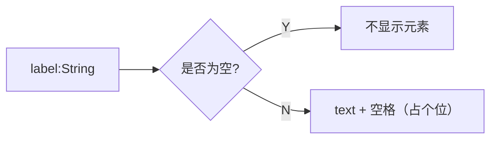

## 基于 element-ui 的表单

参考地址 http://element.eleme.io/1.3/#/zh-CN/component/form

### 需求

| 组件名称 | 组件路径 | 组件说明
| --- | --- | --- |
| nftn-el-input | /components/element-ui/input.vue | 根据类型不同有不同的展示 |
| nftn-el-form | /components/element-ui/main.vue | 带有 grid 布局的表单组件 |

### 依赖
| 组件名称 | 组件路径 | 组件说明
| --- | --- | --- |
| nftn-el-grid | /components/element-ui/grid.vue | 配置自适应网格布局 |

### 图例
```viz
    digraph G {
        "nftn-el-form" -> "nftn-el-grid" -> "nftn-el-input";
        "nftn-el-input" -> text;
        "nftn-el-input" -> select;
        "nftn-el-input" -> datetimepicker;
        "nftn-el-input" -> "...";
    }
```

### 计划
---
#### @/components/element-ui/grid/main.vue ___(20170621)___
##### _配置项_
- [x] `v-bind:grid => Object` 集成 grid 组件配置（按需创建 grid slots） ___(20170621√)___
- [x] `v-bind:action-grid => String` 表单操作位置 ___(20170622 ~ 20170626√)___
- [x] `v-bind:label-position => String(top, left, right)` 表单项标题位置 ___(20170622√)___
- [x] `v-bind:label-width => Number` 表单项标题宽度 ___(20170622√)___
- [x] `v-bind:inputs => Array` 表单项配置 ___(20170622√)___
```javascript
let input = {
    grid: String, // √
    span: Number, // 为单个表单项设置占位长度 (20170704√)
    label: String, // √
    name: String, // √
    datasource: Array, // √
    disabled: Boolean(false), // √
    rules: Array, // √
    rows: Number, // √
    min: Number, // √ // type='checkbox'
    max: Number, // √ // type='checkbox | select'
    multiple: Boolean(false), // type='select' √
    clearable: Boolean(true), // type='select' √
    // 特殊项，只在 form.vue 组件中进行处理
    cascade: Object // type='select' (20170628√)
};
```
- [x] `v-bind:rules` 集成 rules 组件 ___(20170622 ~ 20170626√)___
- [x] `v-model: Object` 集成 input 数据 ___(20170622√)___
- [x] `v-bind:empty-no-post => Boolean(false)` 空数据是否提交 ___(20170704√)___

___

##### _功能项_
- [x] 当 v-model 缺少数据时，自动补全 ___(20170622√)___

___

##### _分发项_
- [x] grid ___(20170626√)___
```html
<nftn-el-form>
    <template slot="grid-0-0">
        替换 grid-0-0 区域的内容，如果不存在这个区域，无效！
    </template>
<nftn-el-form>
```
- [x] label ___(20170626√)___
```html
<nftn-el-form>
    <template slot="inputname.label">
        替换 “inputname” 的label显示内容
    </template>
<nftn-el-form>
```
- [x] input ___(20170626√)___
```html
<nftn-el-form>
    <template slot="inputname.input">
        替换 “inputname” 的输入显示内容
    </template>
<nftn-el-form>
```
---
#### @/components/element-ui/grid/input.vue ___(20170621)___
##### _配置项_
- [x] `v-bind:label => String` ___(20170622√)___

- [x] `v-bind:type => String` ___(20170622√)___
- [x] `v-bind:name => String` ___(20170622√)___
- [x] `v-bind:configs => Object` ___(20170622√)___
- [x] `v-model` ___(20170622√)___
- [x] `v-bind:empty-no-post => Boolean(false)` 空数据是否提交 ___(20170704√)___
- [x] `v-bind:rules` 表单验证规则 ___(20170622 ~ 20170626√)___
- [x] `v-bind:disabled => Boolean(false)` ___(20170627√)___
- [x] `v-bind:datasource => Array` ___(20170622√)___
    ```javascript
    // type="radio | checkbox | select"
    let datasource = [{
        name: String, // display label √
        value: String, // select value √
        disabled: Boolean(false) // is selectable? √
    }];
    ```
- [x] `v-bind:label-key: String` 数据源读取的标题key ___(20170628√)___
- [x] `v-bind:value-key: String` 数据源选取的数据key ___(20170628√)___
- [x] `v-bind:rows => Number // type="textarea"` ___(20170626√)___
- [x] ~~`v-bind:autosize => Object // type="textarea"``~~ ___(20170626 - !)___
- [x] `v-bind:min => Number` ___(20170627√)___
    ```javascript
    // type === 'checkbox' // 最少选择数量
    // type === 'slider'
    ```
- [x] `v-bind:max => Number` ___(20170627√)___
    ```javascript
    //  最多可选数量
    // type === 'checkbox'
    // type === 'select'
    // type === 'slider'
    ```
- [x] `v-bind:multiple => Boolean(false)` 多选模式 ___(20170622 ~ 20170627√)___
    ```javascript
    //  是否可以多选
    // type === 'select'
    ```
- [x] `v-bind:clearable => Boolean(true)` ___(20170627√)___
    ```javascript
    // 是否可清除选项
    // type === 'select'
    ```
- [x] `v-bind:format => String` ___(20170629√)___
    ```javascript
    // 日期显示格式
    // type === 'date'
    // type === 'datetime'
    ```
- [x] `v-bind:on-text => String(ON)` ___(20170629√)___
    ```javascript
    // type === 'switch'
    ```
- [x] `v-bind:off-text => String(OFF)` ___(20170629√)___
    ```javascript
    // type === 'switch'
    ```
- [x] `v-bind:on-value => *(true)` ___(20170629√)___
    ```javascript
    // type === 'switch'
    ```
- [x] `v-bind:off-value => *(false)` ___(20170629√)___
    ```javascript
    // type === 'switch'
    ```
- [x] `v-bind:on-color => String(#20A0FF)` ___(20170629√)___
    ```javascript
    // type === 'switch'
    ```
- [x] `v-bind:off-color => String(#C0CCDA)` ___(20170629√)___
    ```javascript
    // type === 'switch'
    ```
- [x] `v-bind:step => Number(1)` ___(20170704√)___
    ```javascript
    // type === 'slider'
    ```
- [x] `v-bind:show-input => Boolean(false)` ___(20170704√)___
    ```javascript
    // type === 'slider'
    ```
- [x] `v-bind:show-stops => Boolean(false)` ___(20170704√)___
    ```javascript
    // type === 'slider'
    ```
- [x] `v-bind:show-tooltip => Boolean(true)` ___(20170704√)___
    ```javascript
    // type === 'slider'
    ```
- [x] `v-bind:range => Boolean(false)` ___(20170704√)___
    ```javascript
    // type === 'slider'
    ```
- [x] `v-bind:vertical => Boolean(false)` ___(20170704√)___
    ```javascript
    // type === 'slider'
    ```
- [x] `v-bind:height => String(100px)` ___(20170704√)___
    ```javascript
    // vertical 时必填
    // type === 'slider'
    ```

##### _功能项_
- [x] <el-input>
    - [x] 基础模式   ___(20170621√)___
    - [ ] autocomplete 模式 ___(20170622 ~ ?)___
    - [x] 测试提交表单数据的正确性 ___(20170629√)___
- [x] <el-select>
    - [x] 基础 datasource   ___(20170622 ~ 20170627√)___
    - [x] 集成 multiple ___(20170627√)___
    - [x] 集成 max ___(20170627√)___
    - [x] 集成 clearable   ___(20170627√)___
    - [x] ~~自定义模版~~ ___(20170627 - !)___
    - [x] ~~分组~~ ___(20170627 - !)___
    - [x] 自动将纯数组数据变成对象数组数据 ___(20170629√)___
        ```javascript
        let datasource = [1, 'a', 2, 'b'];
        if (datasource instanceof Array && datasource.length) {
            if (typeof datasource[0] !== 'object') {
                datasource = datasource.map(each => {
                    return typeof each !== 'object' ? { name: each, value: each } : each;
                });
            }
        }
        // 输出:
        // [
        //     { name: '1', value: '1' },
        //     { name: 'a', value: 'a' },
        //     { name: '2', value: '3' },
        //     { name: 'b', value: 'b' }
        // ]
        ```
    - [x] 测试提交表单数据的正确性 ___(20170629 ~ 20170704√)___
        ```
        // 数据源 [{ name: 'test', value: '1' }]
        // 默认输出 'test'
        // 正确应输出 '1'
        ```
- [x] <el-date> ___(20170622 ~ ?)___
    - [x] 日期模式 (type='date')  ___(20170622 ~ 20170629√)___
    - [x] 日期时间模式 (type='datetime') ___(20170622 ~ 20170629√)___
    - [x] 日期范围模式 ___(20170622 ~ ?)___
    - [x] 日期时间范围模式 ? ___(20170622 ~ ?)___
    - [x] ~~时间模式 ___(20170622 ~ ?)___~~ 看似用不到
    - [x] ~~时间范围模式 ___(20170622 ~ ?)___~~ 看似用不到
    - [x] 测试提交表单数据的正确性 ___(20170629 ~ 20170629√)___
- [x] <el-radio> ___(20170622√)___
    - [x] 测试提交表单数据的正确性 ___(20170629 ~ 20170629√)___
- [x] <el-checkbox> ___(20170622 ~ 20160627√)___
    - [x] 测试提交表单数据的正确性 ___(20170629 ~ 20170629√)___
- [x] 集成 textarea ___(20170622 ~ 20170626√)___
- [ ] 集成 upload ___(20170622 ~ ?)___
    - [ ] 测试提交表单数据的正确性 ___(20170629 ~ ?)___
- [x] 集成 switch ___(20170622 ~ 20170704√√)___
    - [x] 测试提交表单数据的正确性 ___(20170629 ~ 20170704√)___
- [x] 集成 slider ___(20170622 ~ 20170704√)___
    - [x] 测试提交表单数据的正确性 ___(20170629 ~ 20170704√)___

##### _分发项_
- [x] label ___(20170626√)___
```html
<nftn-el-input>
    <template slot="label">
        替换 label 的输入显示内容
    </template>
<nftn-el-input>
```
- [x] input ___(20170626√)___
```html
<nftn-el-input>
    <template slot="input">
        替换 input 的输入显示内容
    </template>
<nftn-el-input>
```
